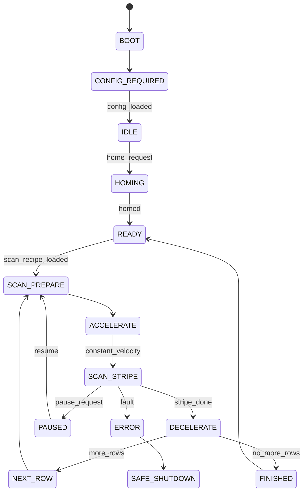
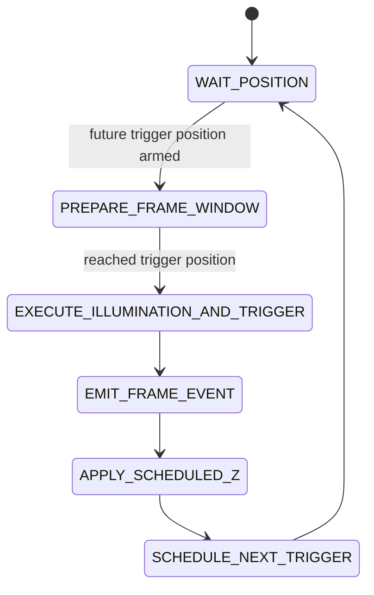
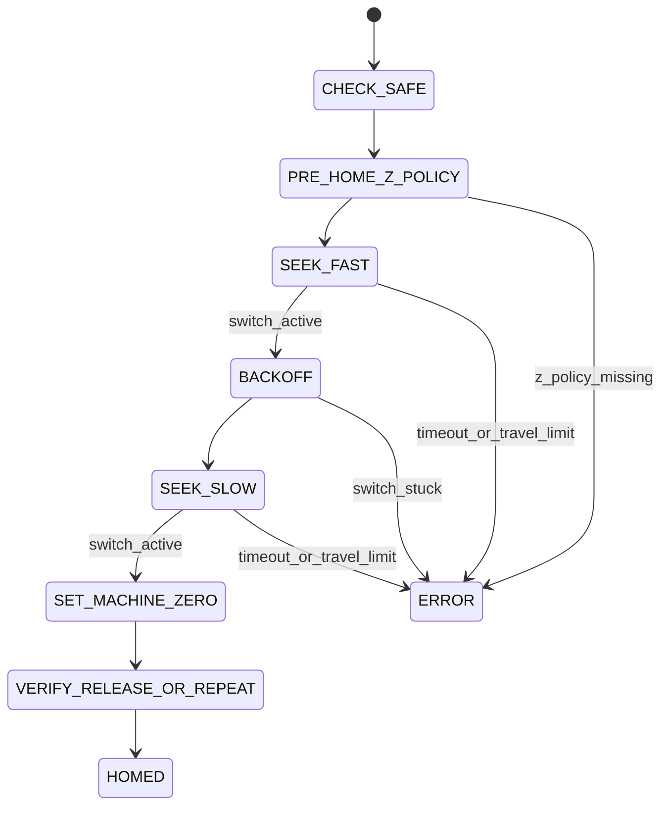

# MCU State Machines

## Top-level state machine

## Scan stripe state machine

For autofocus frames, `EXECUTE_ILLUMINATION_AND_TRIGGER` is an atomic timing
window owned by the MCU: suppress preview white if configured, enable the
red/green autofocus gates, wait the configured settle time, emit the camera
trigger, hold through the exposure window, disable red/green and restore preview
white. `FRAME_EVENT` is emitted only as the fact record for that completed
trigger/illumination window; future lookahead must use a distinct advisory event
such as `FRAME_ARMED` and must not be consumed as acquired-frame metadata.

## Homing state machine

